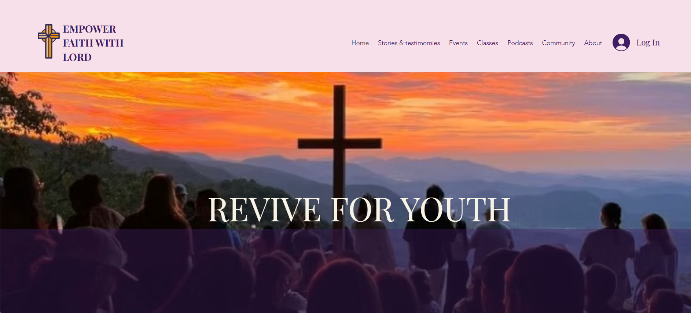
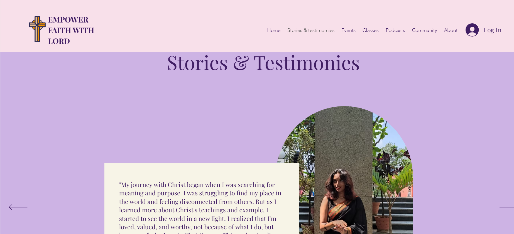

# Empowering Faith – Capstone Project 🌐  

This was my final year **capstone project**, a full website designed and built on **Wix Studio**.  
The goal of *Empowering Faith* was to create an accessible platform where people can learn about the mission, explore resources, and support the community.  

It combines thoughtful design with functionality, including sections for information, engagement, and future features like donations and live AI chat.  
 

---

## 🛠 Tech & Tools
- Wix Studio (No-code Website Builder)  
- Custom Layout Design  
- Image Editing (Canva)  

---

## 📂 Features
- Multi-page layout with Home, About, Stoires & Testimonies, Events and more 
- Responsive design optimized for desktop and mobile  
- Use of custom visuals, typography, and branding elements  
- Easy-to-navigate structure for better user experience  

---

## 🖼 Screenshots

### Homepage

### Stories & Test Page

---

## 🌐 Live Demo
[View Website](https://sharonmichellet02.wixsite.com/empowering-faith-3)

---

## 🚀 Future Improvements
- Add a **donation system** with QR code / banking integration  
- Implement **live AI chat support** for user interaction  
- Enable **secure payment gateway** for contributions  
- Add **user account & login** for personalized access  

